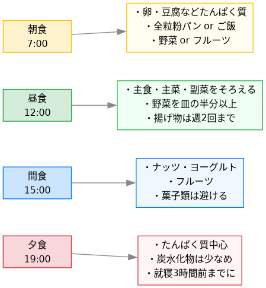

# 1日の健康的な食生活

## 全体の流れ

## 基本の考え方

食事の質は「何を食べるか」より「1日全体のバランス」で決まります。
1食だけ完璧にしようとするより、4つの食事機会をそれぞれ役割分担させるのが継続しやすいです。

## 各食事のポイント

### 朝食（7:00）

1日の代謝スイッチを入れる役割。

- **たんぱく質を必ず入れる**：卵・豆腐・ヨーグルトのどれか1つ
- 炭水化物は全粒粉パンか雑穀米が望ましい
- 時間がなければバナナ＋ゆで卵でも十分

### 昼食（12:00）

1日で最も多くのカロリーを取っていい食事。

- 主食・主菜・副菜の「定食型」を意識する
- 皿の半分を野菜にする
- 揚げ物は週2回を上限の目安に

### 間食（15:00）

夕食前の血糖値急落を防ぐ役割。少量でOK。

- ナッツ・ヨーグルト・フルーツが最適
- 菓子類は血糖値スパイクを起こすので避ける

### 夕食（19:00）

翌朝に向けて体を回復させる食事。

- たんぱく質（魚・鶏肉・豆類）を中心に
- 炭水化物は朝・昼より少なめにする
- **就寝3時間前までに食べ終える**のが原則

## まとめ：守るべき3つのルール

1. 朝食を抜かない
2. 昼食を1日で一番しっかり食べる
3. 夕食は軽めに、早めに
