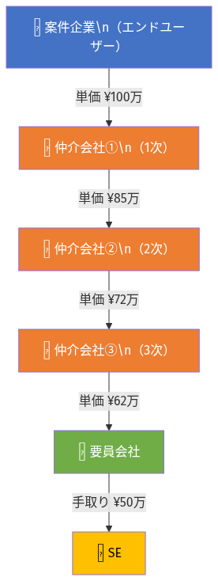
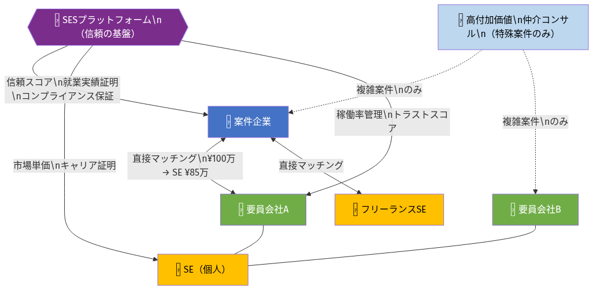
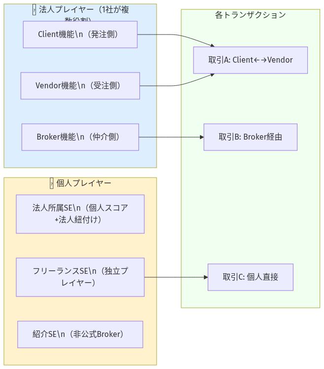
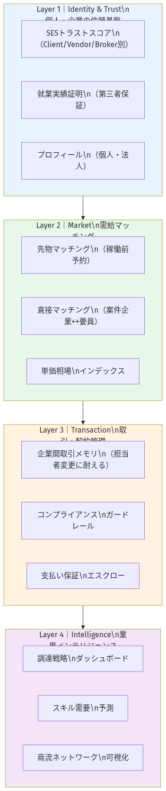
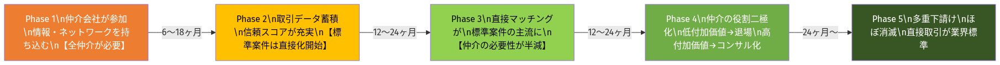
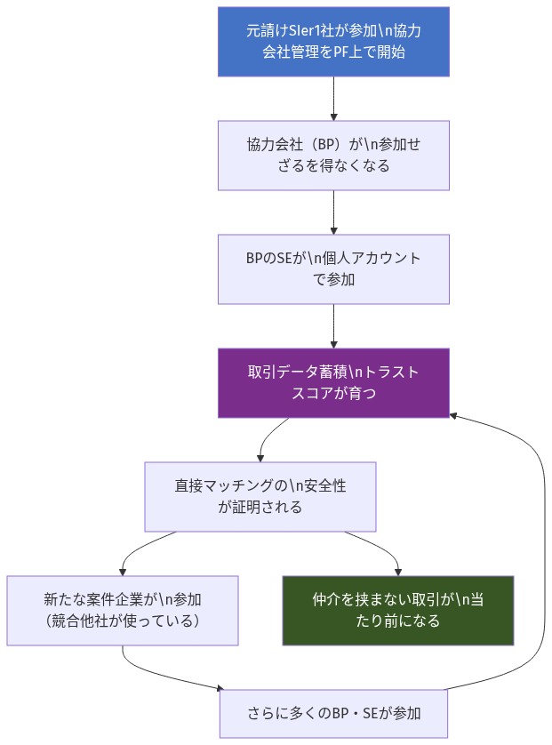
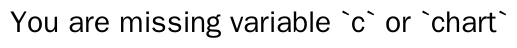

# SESプラットフォーム 総合設計書

> 本書はこれまでの全分析（参加者インサイト・企業視点・BtoB乗り換え事例・役割モデル・個人vs組織の対立）を統合し、**完成形の世界観から逆算した設計**を提示する。
> 基本方針：仲介業者を強制排除するのではなく、**プラットフォームが直接取引を安全・安価にすることで、仲介の必要性を自然消滅させる。**

---

## Part 0：エグゼクティブサマリー

### 解決する問題

SES業界では案件企業とエンジニアの間に複数の仲介業者が介在し、エンジニアへの報酬が大幅に目減りする多重下請け構造が常態化している。この構造は「信頼の不在」「情報の非対称性」「取引コストの高さ」という3つの根本原因によって維持されている。

### 解決策の本質

この3つの根本原因をプラットフォームが解消することで、**仲介業者の存在意義を段階的に失わせる**。仲介業者を敵に回すのではなく、「プラットフォームに乗ることで価値が証明できる」という参加インセンティブで取り込み、取引データの蓄積によって自然に直接取引へ移行させる。

### 完成形

2030年のSES業界において、案件企業とエンジニア（個人・要員会社）が**信頼スコアと就業実績証明をもとに直接取引することが標準**となっている世界。仲介業者は「複雑な案件の戦略コンサルタント」として少数精鋭で生き残っている。

---

## Part 1：2030年の世界観

### 現在（2026年）の姿



案件企業が支払う単価100万円のうち、エンジニアの手元に届くのは50万円以下。3〜5社の仲介業者がそれぞれマージンを取り、**実際に価値を生んでいる人間**への報酬が半分以下になる。

この構造が維持される理由：

- **信頼の不在**：案件企業は見知らぬBP会社を信頼できない → 長年の付き合いがある仲介会社を通じる
- **情報の非対称性**：「良いエンジニアがどこにいるか」を仲介会社しか知らない
- **取引コストの高さ**：新しい相手と取引を始めるための調査・交渉コストが高い

### 2030年の姿（プラットフォーム完成後）



- 案件企業は「SESトラストスコア認定済み」の要員会社・個人SEと**直接マッチング**
- エンジニアは単価の80〜90%を受け取る
- 複雑な案件・新市場開拓のみ、高付加価値仲介コンサルが関与
- 商流の深さはプラットフォームが自動監視し、コンプライアンス違反を防止

---

## Part 2：問題の構造分析

### 仲介業者が増え続ける根本原因

仲介業者は「悪い存在」ではない。**信頼・情報・コストという3つの市場の失敗**が生み出した合理的な存在だ。

| 根本原因 | 仲介業者が解決していること | プラットフォームが代替できること |
| -------- | -------------------------- | -------------------------------- |
| **信頼の不在** | 「私が保証する」という人的信頼 | トラストスコア・就業実績証明による**データ的信頼** |
| **情報の非対称性** | 「良い人材がどこにいるか」を知っている | 全取引データから生成される**市場の透明性** |
| **取引コストの高さ** | 新規取引の手間を肩代わり | 標準化されたマッチングフローによる**コスト圧縮** |

この3つが解消されると、仲介業者の存在価値は「複雑性・特殊性の高い案件」にのみ残る。

---

## Part 3：プラットフォームの設計思想

### 役割モデル：「3種類の企業」ではなく「動的な役割」



現実のSES業界では1社が複数の役割を兼ねる。「案件企業・仲介会社・要員会社」という**固定分類を廃止**し、取引ごとに役割を動的に定義する。

#### プレイヤーの種類

**法人プレイヤー（企業）**

- 各取引において `Client（発注側）` / `Vendor（受注側）` / `Broker（仲介）` の役割を持つ
- 同一企業が取引AではClient、取引BではVendorになれる
- スコアは役割別に分離して蓄積（「良いClientだが、Vendorとしての実績は少ない」が正確に表現される）

**個人プレイヤー**

- **法人所属SE**：法人アカウントに紐付けつつ、個人スコアも並行蓄積。退職後も個人の実績は消えない
- **フリーランスSE（個人事業主）**：法人を介さず直接Vendorとして参加
- **紹介SE**：知人紹介で非公式Broker機能を果たす。紹介リンクで透明な仲介に変換

#### 役割別トラストスコア

```
XYZ株式会社のスコア
├── Clientスコア  87点（132件）：支払い遵守・条件変更なし・評価の公平性
├── Vendorスコア  74点（98件）： SE定着率・スキル証明の正確性・契約遵守
└── Brokerスコア  91点（17件）：マッチング定着率・条件の正確な伝達
```

### 副作用設計原則（設計の背骨）

> **個人が自分の利益のために使う行動が、自動的に組織の資産になる**

PMが面談後3クリックで選択する採用理由 → CFO向け調達ダッシュボードが自動生成される。仲介営業が自分のポートフォリオのために入力した情報 → 会社のCRMが自動で埋まる。SEがキャリア証明のために更新したプロフィール → 要員会社のスキルポートフォリオが可視化される。

「現場に使わせる設計」と「経営の意思決定データを作る設計」を**同一の行動**で実現する。

---

## Part 4：エコシステムの全体設計



### Layer 1：Identity & Trust（信頼の基盤）

プラットフォームの土台。ここが充実するほど直接取引が安全になり、仲介の必要性が下がる。

**SESトラストスコア**

役割別（Client/Vendor/Broker）に分離した企業信用スコア。取引実績・支払い行動・契約遵守率・評価の一貫性から自動生成。帝国データバンクが持たない「SES取引固有の信頼情報」。

**就業実績の第三者証明**

SE・案件企業・要員会社の三者が承認した就業事実をプラットフォームが公式記録。自己申告のスキルシートではなく「三者合意の証明書」として機能。個人に帰属し、転職・独立後も有効。

**個人プロフィール（ポータブルキャリア）**

スキル・就業実績・評価スコア・市場価値ポジションを一元管理。個人が法人を離れても引き継がれる「生涯のキャリア資産」。

### Layer 2：Market（需給マッチング）

**先物マッチング（稼働前予約市場）**

「3ヶ月後に空く予定のSE」と「3ヶ月後に始まる案件」を今から照合。SESの最大の構造的問題であるベンチコスト・突発的調達を解消。メールでは原理的に実現不可能。

**直接マッチングエンジン**

トラストスコアが一定水準を超えた企業・個人間での直接マッチング。仲介を通さずに案件と人材が繋がる。スコアが高いほど優先表示・手数料優遇。

**単価相場インデックス**

全取引から生成されるリアルタイム単価データ。スキル別・経験年数別・地域別の相場を提供。SEの交渉根拠、案件企業の予算設定根拠になる。

### Layer 3：Transaction（取引・契約管理）

**企業間取引メモリ（Corporate Trade Memory）**

担当者が退職しても引き継がれる企業間関係の記録。「山田さんが辞めたら調達ができなくなった」を構造的に解消。法人契約の最大の正当化理由。

**コンプライアンスガードレール**

商流の深さを自動判定（何次請けかを検知）。監査ログを自動生成し、労働局調査・社内監査に耐えられる証跡を常備。「把握できていないこと自体がリスク」を解消。

**支払い保証・エスクロー**

新規取引の最大ハードルである「不払いリスク」をプラットフォームが引き受ける。「初めての相手とも安心して取引できる」ことで、既存仲介ルート以外の直接取引を後押し。

### Layer 4：Intelligence（業界インテリジェンス）

**調達戦略ダッシュボード（経営層向け）**

- 外部人材費の月次・四半期サマリー
- 特定BPへの依存度アラート（「御社はXX社への依存度が67%」）
- スキルギャップ予測（「来年Q2にクラウド系エンジニアが不足する可能性」）

**商流ネットワーク可視化**

「この取引はA社→B社→C社→SEという3次請け構造」をグラフとして可視化。コンプライアンス部門が即座に把握できる。

---

## Part 5：仲介排除のメカニズム

### なぜ「強制排除」ではなく「自然消滅」か

仲介会社を直接排除しようとすれば全力の妨害を招く。仲介会社は業界の情報流通の主要プレイヤーであり、彼らが反対すればプラットフォームは普及しない。

正しい戦略：**仲介会社をプラットフォームに引き込み、取引データを蓄積させる。データが充実するほど直接取引が安全になり、仲介の必要性が自然に下がる。**



### フェーズ別の仲介への対応

| フェーズ | 仲介会社への態度 | 設計の重点 |
| -------- | ---------------- | ---------- |
| Phase 1-2 | 積極的に招待・参加させる | 「仲介経由でも使える」設計、仲介スコアで価値証明の舞台 |
| Phase 3 | 直接取引を促進しながら仲介の新役割を提示 | 「高付加価値仲介vs通過点仲介」の差別化が可視化 |
| Phase 4 | 低付加価値仲介は自然淘汰、高付加価値は継続 | 複雑案件のみBroker手数料が発生する設計 |
| Phase 5 | 生き残った仲介は「SESコンサルタント」として尊重 | 純粋なマッチング手数料ビジネスは消滅 |

### フライホイール設計



一度回り始めると自己強化するループを設計する。データが増えるほどマッチング精度が上がり、マッチング精度が上がるほど参加者が増え、参加者が増えるほどデータが増える。

---

## Part 6：参入戦略の4案と選定

### 4つの戦略オプション

| 戦略 | 概要 | 強み | 弱み |
| ---- | ---- | ---- | ---- |
| **A：オープンマーケット型** | 誰でも参加できる公開市場 | 最速の量的成長 | 品質の希薄化、仲介のゲーミング |
| **B：招待制クローズド型** | 審査を通過した企業のみ参加 | 高品質・信頼性 | 鶏と卵問題、成長が遅い |
| **C：ティア制ハイブリッド型** | 参加資格を段階的に設定 | 品質管理＋成長の両立 | 設計の複雑性 |
| **D：元請けSIer起点型** | 大手1社がアンカーとなりドミノ普及 | 取引先引力による強制的普及 | アンカー企業1社への初期依存 |

### 推奨：CとDの組み合わせ

**Phase 1でD（元請けSIer起点）を実行し、Phase 2以降でC（ティア制）に移行する。**

元請けSIer1社が「協力会社管理をプラットフォームで一元化する」と決めた瞬間、その会社と取引する2次請け・3次請け企業への参加強制が自動的に連鎖する。これが「自発的参加」ではなく「参加しなければ取引できない」という真の引力を生む。

参加企業が増えた段階でティア制を導入し、トラストスコアの高い企業が優遇される競争環境を作る。

#### 法人導入の3トリガー（経営層を動かす）

現場PMの利便性だけでは法人契約にならない。以下の3つの「組織の痛み」に直接答えることが法人決裁を引き出す：

1. **コンプライアンスリスクの顕在化**（法務・経営が動く）：多重商流の実態を把握・報告できないリスク
2. **担当者退職による調達崩壊**（経営者が動く）：「山田さんが辞めたら調達できなくなった」事件
3. **CFOの可視化要求**（財務が動く）：「外部人材費の総額・内訳をレポートせよ」という要求

---

## Part 7：実装ロードマップ



### Phase 0（0〜3ヶ月）：基盤構築

**目標**：動くプロトタイプと最初の3社

**やること**：

- 役割モデル（Client/Vendor/Broker/Individual）を実装したプロフィール基盤
- 就業実績証明の最小版（三者承認ボタン）
- 単価相場インデックスの試算版（手動データでも可）

**KPI**：プロフィール登録3社・就業実績証明1件の達成

**やってはいけないこと**：AIマッチング・複雑な機能の実装。「三者承認ボタン」1機能を完璧に動かすことに集中する。

---

### Phase 1（3〜9ヶ月）：アンカー企業の獲得

**目標**：中堅SIer1社の法人導入・協力会社10〜20社の参加連鎖

**やること**：

- 中堅SIer1社の調達部門長・法務担当者にアプローチ
- 提案内容は「コンプライアンスガードレール」に絞る（現場PMの便利さではなく法務コスト削減で売る）
- アンカー企業が上位5〜10社のコアBP企業に「評価ログをプラットフォームで管理したい」と提案
- SEの就業実績証明を受け取ったSEが「次の案件交渉で使う」体験をドキュメント化

**KPI**：参加企業20社・就業実績証明20件・コンプライアンス違反検知1件以上

**重点施策（現場の個人とアンカー企業を同時に動かす）**：

```
アンカーSIerへの提案（トップダウン）
  ↓ 法人導入決定
協力会社に「プラットフォームで管理したい」通知
  ↓ BP企業が参加
BP企業のSEが個人アカウントを作成
  ↓ 個人スコアの蓄積開始
SEが「就業実績証明を受け取る」体験
  ↓ SEが友人・同僚を招待
ボトムアップ口コミが発生
```

---

### Phase 2（9〜18ヶ月）：直接取引の芽生え

**目標**：初の「仲介なし直接マッチング」の成立・参加80社

**やること**：

- トラストスコアが蓄積された企業間での直接マッチング機能をリリース
- 「直接取引の方が手数料が安い」という価格設計を明示
- 先物マッチング（稼働前予約）の試験運用
- 単価相場インデックスの外部公開

**KPI**：直接マッチング比率25%・参加企業80社・SE個人参加500名

**この時期に起きること**：

- 一部の仲介会社が「プラットフォームを通じた仲介のBrokerスコア」を競い合い始める
- 「Brokerスコアが低い仲介会社」の案件が避けられ始める → 低付加価値仲介の自然淘汰が始まる

---

### Phase 3（18〜36ヶ月）：ネットワーク効果の爆発

**目標**：参加企業300社・直接マッチング比率55%・2社目のアンカー企業獲得

**やること**：

- 2社目の元請けSIerをアンカーとして獲得（「競合がもう使っている」というトリガーを活用）
- 企業間取引メモリの本格展開（担当者引継ぎ機能）
- 調達戦略ダッシュボードのリリース（CFO・経営企画向け）
- ティア制の導入（Premium/Standard/Newの3段階）

**KPI**：参加企業300社・直接マッチング55%・法人契約更新率80%以上

---

### Phase 4（36ヶ月〜）：業界標準化

**目標**：「SESはプラットフォームで」が業界の当たり前になる

**起きること**：

- 参加していない企業との取引が「未検証商流」としてフラグされ始める
- 多重下請けが減少し、直接取引が標準になる
- 仲介会社は「複雑案件のSESコンサルタント」として少数精鋭で生き残る
- SE個人は市場価値を透明に把握し、要員会社との交渉力が対等になる

---

## Part 8：収益モデルの設計

仲介業者を排除する方向に進む場合、収益構造も変わる。

### 推奨収益モデル：マルチレイヤー課金

| 収益源 | 対象 | 課金方式 | 金額感 |
| ------ | ---- | -------- | ------ |
| 直接マッチング手数料 | 案件企業 / 要員会社 | 成約時3〜5% | 仲介会社の15〜30%より大幅に安い |
| Broker手数料 | Broker機能を使う仲介会社 | 成約時5〜8% | ただし付加価値証明が必要 |
| 法人サブスクリプション | 案件企業・要員会社 | 月額固定 | 管理機能・ダッシュボード利用料 |
| コンプライアンスレポート | 案件企業（法務・経営） | 月額固定 | 監査対応・商流可視化ツール |
| データインテリジェンス | 大企業・調査機関 | 年間契約 | 業界需給データの販売 |

### 仲介排除が進むほど収益が上がる構造

直接マッチングの比率が上がるほど、プラットフォームの手数料収入の総額は増える（仲介会社が抜いていたマージンの一部がプラットフォームへ）。「仲介を排除すること」と「プラットフォームが儲かること」が同一方向を向く設計。

---

## Part 9：リスクと対策

### リスク1：仲介会社の全力妨害

仲介会社がプラットフォームを「自分たちを不要にするもの」と認識した場合、業界全体を使って普及を阻もうとする。

**対策**：Phase 1〜2では仲介会社を「排除対象」ではなく「最初の協力者」として位置づける。「Brokerスコアを積むことで、自分の価値が証明できる舞台」として参加させる。排除は彼らが自分でデータを積み上げた結果として「自然に」起きる。

### リスク2：アンカー企業1社への依存

最初の元請けSIアンカー企業が離脱した場合、プラットフォームが崩壊する。

**対策**：Phase 1では「完全なプラットフォーム移行」ではなく「協力会社評価管理の一部」から始め、アンカー企業の依存度を下げてから次フェーズへ進む。Phase 2で2社目のアンカーを確保することを必達目標にする。

### リスク3：法的リスク（労働者派遣法・二重派遣）

プラットフォームが仲介機能を持つ場合、労働者派遣法上の「派遣元」と解釈されるリスク。個人のBroker機能（紹介報酬）が「二重派遣」と解釈されるリスク。

**対策**：法律上の位置づけを「取引プラットフォーム（場の提供）」に限定し、「派遣元」にならない契約設計。法務専門家と連携し、各機能のリリース前に法的レビューを必須化。個人のBroker機能は「紹介料」ではなく「プラットフォーム内ポイント」として設計し、現金化時に税務・法務確認を挟む。

### リスク4：スコアの信頼性崩壊

トラストスコアが操作・ゲーミングされた場合、プラットフォーム全体の信頼が失われる。

**対策**：スコアは「自己申告」ではなく「取引実績から自動生成」する設計。人間が操作できる入力点を最小化する。異常なスコア上昇（短期間での急上昇）を自動検知するアルゴリズムを組む。

---

## Part 10：やってはいけないこと（総まとめ）

これまでの全分析から導かれた「失敗パターン」の一覧。

| やってはいけないこと | 失敗の理由 |
| -------------------- | ---------- |
| 仲介会社を最初から排除しようとする | 業界の全力妨害を招く。彼らを取り込んでから自然淘汰させる |
| 全機能を同時にリリースする | 何も使われない。「三者承認ボタン1つ」を完璧に体験させることから始める |
| 現場PMの便利さで法人営業する | 現場の判断では法人契約にならない。法務・CFO・経営に別々の言語で売る |
| AIマッチングを最初のウリにする | AIが作れることはAIが複製できる。差別化にならない |
| スコアを全員に最初から公開する | 低スコア企業が離脱してエコシステムが縮小する |
| 直接取引と仲介取引を同じ手数料にする | 直接取引の優遇がないと移行インセンティブが生まれない |
| 個人SEを「法人の一部」として扱う | 「自分の実績は自分のもの」という個人の根本的インサイトを無視している |

---

## 結論：3つの核心

### 核心1：信頼を「人脈」から「データ」に置き換える

多重下請けが消えない根本は「初めての相手を信頼できない」ことだ。トラストスコア・就業実績証明・コンプライアンスガードレールが組み合わさって初めて、「データによる信頼」が「人脈による信頼」を代替できる。

### 核心2：副作用設計で個人と組織を同時に動かす

個人が自分の利益のために使う行動が、自動的に組織の資産になる設計。「現場が使いたいから使う」と「経営が導入すべきだから契約する」を同一のシステムで実現する。BtoBプロダクトの2つの壁を同一設計で越える。

### 核心3：元請け1社の引力で業界を変える

「便利だから使いたい」は広がらない。「使わないと取引できない」が業界標準化の唯一の道だ。最初の元請けSIer1社を口説くことにリソースを集中させる。その1社が決めれば、100社の協力会社への参加強制が連鎖する。
