# プロダクト企画書_要員管理サービス_20251219

> Auto-extracted by pptx_read.ps1

## Slide 1

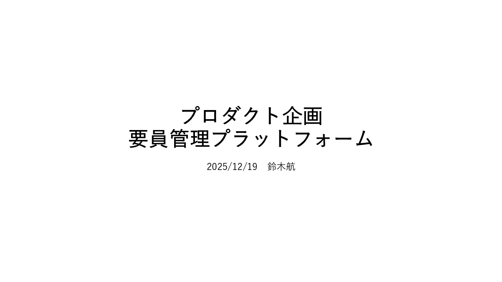

プロダクト企画 要員管理プラットフォーム 2025/ 12 / 19 　鈴木航

## Slide 2

SES 事業において、要員と案件のマッチングに課題が存在する。 2026/3/9 2 要因として以下理由から　 SES ネットワーク * でのマッチングが十分行えていないこと 　が挙げられる 経歴書と面談によるの事前評価が難しく 、現場とのアンマッチが起きやすい 専門知識を起きやすい選考 及び 面談による選考 が必要で、 E メールを使った人力作業 によって行われている これらのやり取りが 多数関係者間で行われるため機会損失が発生 している 案件会社 要員会社 良い要員が見つからない 良い案件が見つからない * SES ネットワークとは案件 / 要員の募集 / 提案を行うための繋がりを指す。多重下請け構造から情報網が複雑化している。 案件 会社 要員 会社 仲介 会社 仲介 会社 仲介 会社 仲介 会社 SES ネットワークのイメージ 課題

## Slide 3

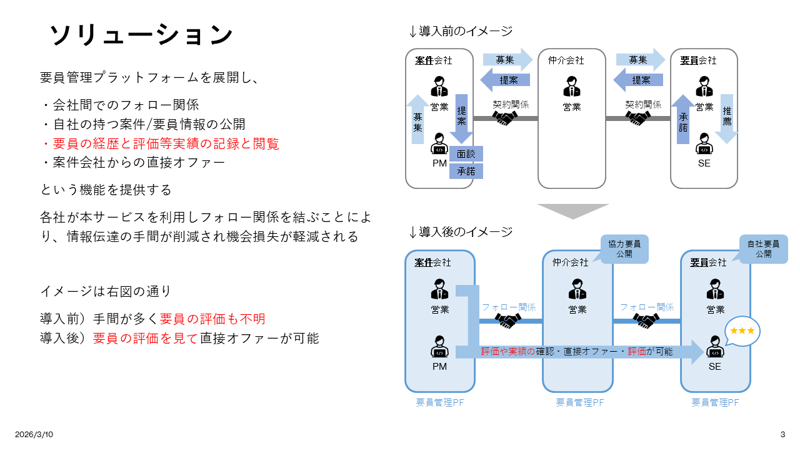

2026/3/9 3 ソリューション 契約関係 案件 会社 営業 PM 仲介会社 営業 要員 会社 営業 SE 募集 提案 募集 提案 承諾 契約関係 募集 提案 面談 承諾 推薦 フォロー関係 案件 会社 営業 PM 仲介会社 営業 要員 会社 営業 SE フォロー関係 評価や実績の 確認 ・直接 オファー・ 評価 が可能 要員管理 PF 要員管理 PF 要員管理 PF 要員管理プラットフォームを展開し、 ・会社間でのフォロー関係 ・自社の持つ案件 / 要員情報の公開 ・要員の経歴と評価等実績の記録と閲覧 ・案件会社からの直接オファー という機能を提供する 各社が本サービスを利用しフォロー関係を結ぶことにより、情報伝達の手間が削減され機会損失が軽減される イメージは右図の通り 導入前）手間が多く 要員の評価も不明 導入後） 要員の評価を見て 直接オファーが可能 ↓導入前のイメージ ↓導入後のイメージ 協力要員 公開 自社 要員 公開 ★★★

## Slide 4

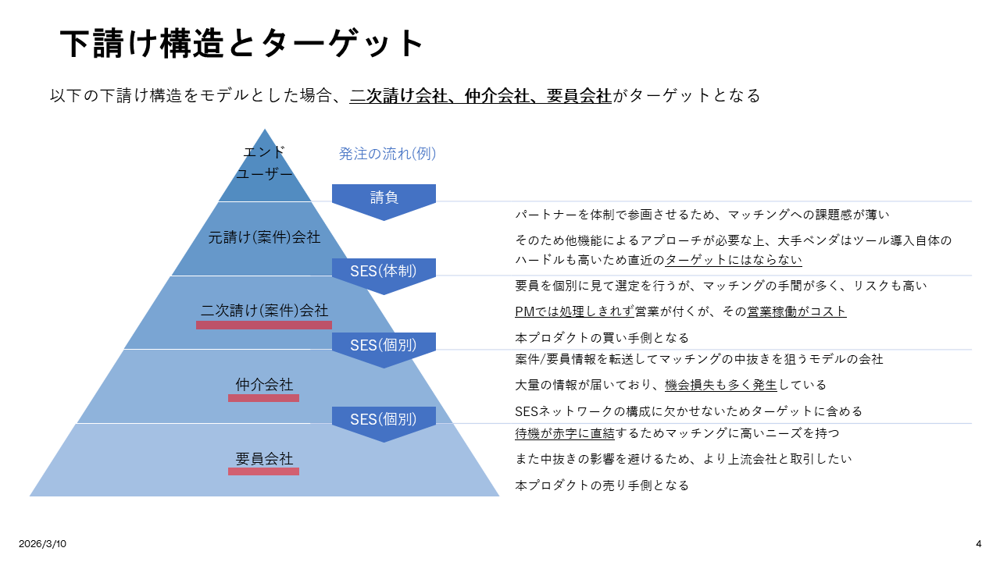

2026/3/9 4 下請け構造とターゲット 以下の下請け構造をモデルとした場合、 二次請け会社、仲介会社、要員会社 がターゲットとなる 請負 SES( 体制 ) SES( 個別 ) SES( 個別 ) 発注 の流れ ( 例 )

## Slide 5

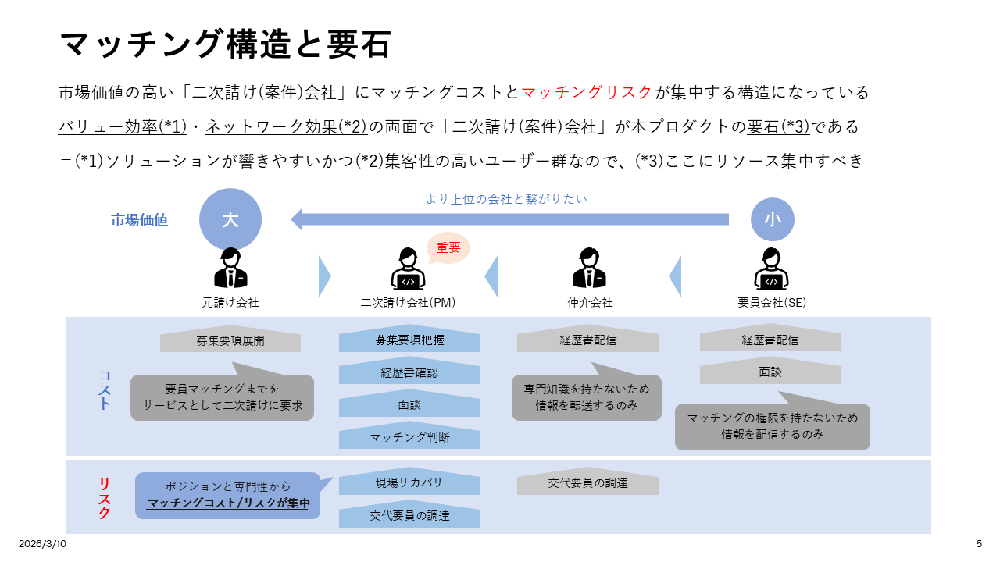

大 市場価値の高い「二次請け ( 案件 ) 会社」にマッチングコストと マッチングリスク が集中する構造になっている バリュー効率 (*1) ・ ネットワーク効果 (*2) の両面で「二次請け ( 案件 ) 会社」が本プロダクトの 要石 (*3) である ＝ ( *1) ソリューションが響きやすい かつ ( *2) 集客性の高いユーザー群 なので、 ( *3) ここにリソース集中 すべき 2026/3/9 5 マッチング構造と要石 元請け会社 二次請け会社 (PM) 仲介会社 要員会社 (SE) 要員マッチングまでを サービスとして二次請けに要求 専門知識を持たないため 情報を転送するのみ マッチングの権限を持たないため 情報を配信するのみ 経歴書確認 募集 要項 把握 面談 マッチング判断 ポジションと専門性から マッチングコスト / リスクが集中 募集要項展開 経歴書配信 経歴書配信 面談 小 市場価値 より上位の会社と繋がりたい コスト 重要 リスク 現場リカバリ 交代要員の調達 交代要員の調達

## Slide 6

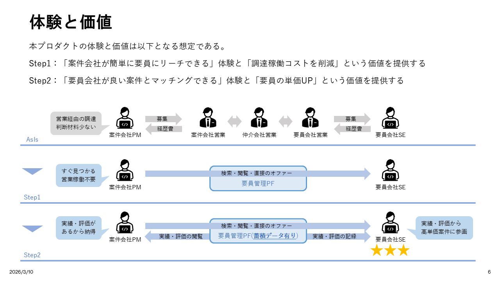

本プロダクトの体験と価値は以下となる想定である。 Step1 ：「案件会社が簡単に要員にリーチできる」体験と「調達稼働コストを削減」という価値を提供する Step2 ：「要員会社が良い案件とマッチングできる」体験と「要員の単価 UP 」という価値を提供する 2026/3/9 6 体験と価値 要員管理 PF 実績・評価の閲覧 実績・評価の記録 案件 会社 PM 要員会社 SE すぐ見つかる 営業稼働不要 検索・閲覧・直接のオファー 案件 会社 PM 案件会社営業 仲介 会社営業 要員会社営業 要員会社 SE 営業経由の調達 判断材料少ない 募集 経歴書 募集 経歴書 要員管理 PF( 蓄積データ有り ) 案件 会社 PM 要員会社 SE 実績・評価が あるから納得 検索・閲覧・直接のオファー 実績・評価から 高単価案件に参画 AsIs Step1 Step2

## Slide 7

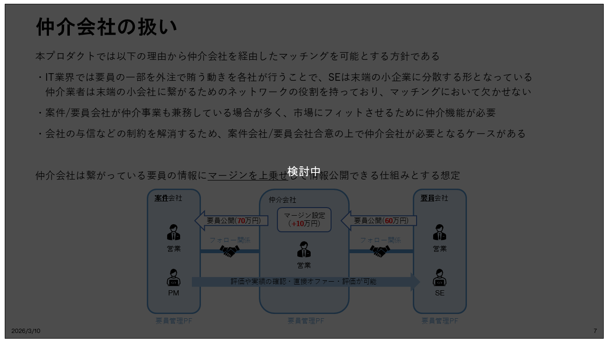

本プロダクトでは以下の理由から仲介会社を経由したマッチングを可能とする方針である ・ IT 業界では要員の一部を外注で賄う動きを各社が行うことで、 SE は末端の小企業に分散する形となっている 　仲介業者は末端の小会社に繋がるためのネットワークの役割を持っており、マッチングにおいて欠かせない ・案件 / 要員会社が仲介事業も兼務している場合が多く、市場にフィットさせるために仲介機能が必要 ・会社の与信などの制約を解消するため、案件会社 / 要員会社合意の上で仲介会社が必要となるケースがある 仲介会社は繋がっている要員の情報に マージンを上乗せ して情報公開できる仕組みとする想定 2026/3/9 7 仲介会社の扱い 案件 会社 仲介会社 要員 会社 フォロー関係 営業 PM 営業 営業 SE フォロー関係 評価や実績の確認・直接オファー・評価が可能 要員管理 PF 要員管理 PF 要員管理 PF 要員公開 ( 60 万円 ) マージン設定 （ +10 万円） 要員公開 ( 7 0 万円 ) 検討中

## Slide 8

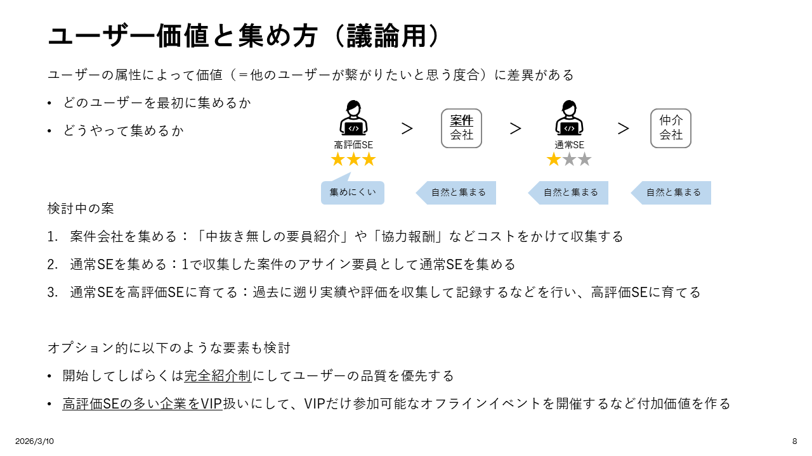

ユーザーの属性によって価値（＝他のユーザーが繋がりたいと思う度合）に差異がある どのユーザーを最初に集めるか どうやって集めるか 2026/3/9 8 ユーザー価値と集め方（議論用） 案件 会社 仲介 会社 ＞ 高評価 SE 通常 SE ＞ ＞ 集めにくい 自然と集まる 自然と集まる 自然と集まる 検討中の案 案件会社を集める：「中抜き無しの要員紹介」や「協力報酬」などコストをかけて収集する 通常 SE を集める： 1 で収集した案件のアサイン要員として通常 SE を集める 通常 SE を高評価 SE に育てる：過去に遡り実績や評価を収集して記録するなどを行い、高評価 SE に育てる オプション的に以下のような要素も検討 開始してしばらくは 完全紹介制 にしてユーザーの品質を優先する 高評価 SE の多い企業を VIP 扱いにして、 VIP だけ参加可能なオフラインイベントを開催するなど付加価値を作る

## Slide 9

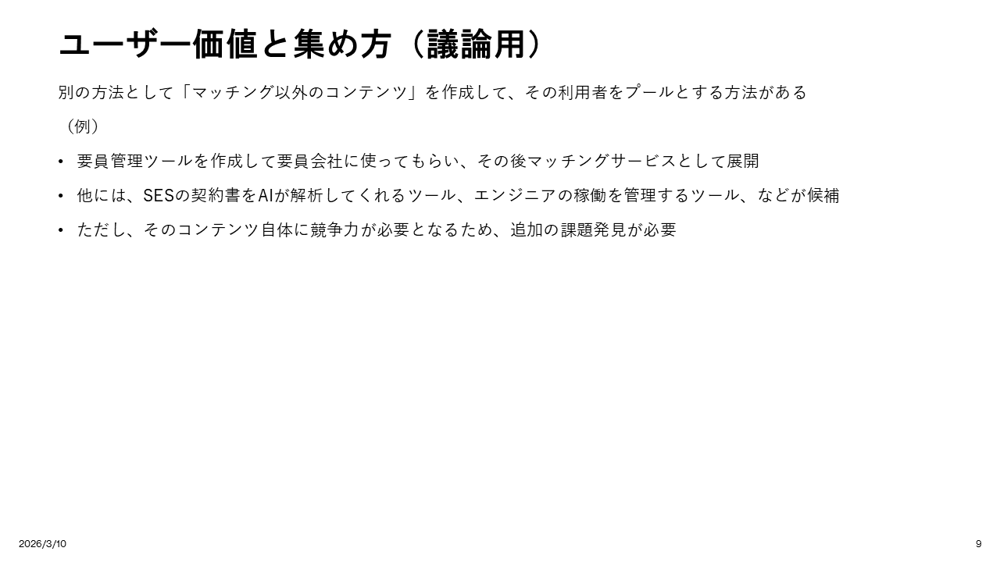

別の方法として「マッチング以外のコンテンツ」を作成して、その利用者をプールとする方法がある （例） 要員管理ツールを作成して要員会社に使ってもらい、その後マッチングサービスとして展開 他には、 SES の契約書を AI が解析してくれるツール、エンジニアの稼働を管理するツール、などが候補 ただし、そのコンテンツ自体に競争力が必要となるため、追加の課題発見が必要 2026/3/9 9 ユーザー価値と集め方（議論用）

## Slide 10

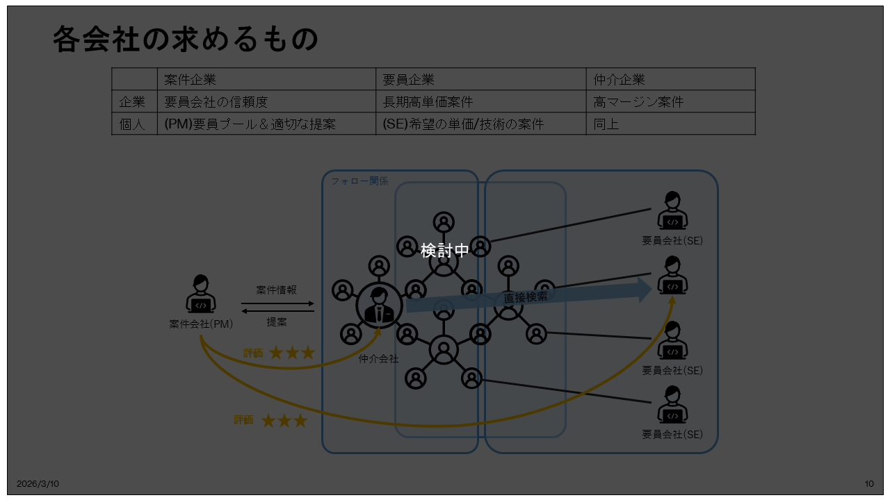

2026/3/9 10 各会社の求めるもの 案件企業 要員企業 仲介企業 企業 要員会社の信頼度 長期高単価案件 高マージン案件 個人 (PM) 要員プール＆適切な提案 (SE) 希望の単価 / 技術の案件 同上 案件会社 (PM) 要員会社 (SE) 要員会社 (SE) 要員会社 (SE) 仲介 会社 直接検索 案件情報 提案 評価 評価 フォロー関係 検討中

## Slide 11

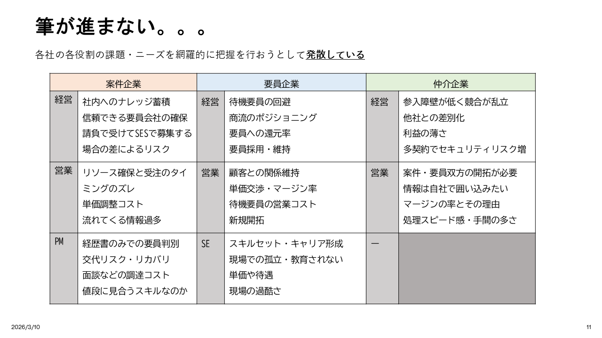

各社の各役割の課題・ニーズを網羅的に把握を行おうとして 発散している 2026/3/9 11 筆が進まない。。。 案件企業 要員企業 仲介企業 経営 社内へのナレッジ蓄積 信頼できる要員会社の確保 請負で受けて SES で募集する場合の差によるリスク 経営 待機要員の回避 商流のポジショニング 要員への還元率 要員採用・維持 経営 参入障壁が低く競合が乱立 他社との差別化 利益の薄さ 多契約でセキュリティリスク増 営業 リソース確保と受注のタイミングのズレ 単価調整コスト 流れてくる情報過多 営業 顧客との関係維持 単価交渉・マージン率 待機要員の営業コスト 新規開拓 営業 案件・要員双方の開拓が必要 情報は自社で囲い込みたい マージンの率とその理由 処理スピード感・手間の多さ PM 経歴書のみでの要員判別 交代リスク・リカバリ 面談などの調達コスト 値段に見合うスキルなのか SE スキルセット・キャリア形成 現場での孤立・教育されない 単価や待遇 現場の過酷さ ー

## Slide 12

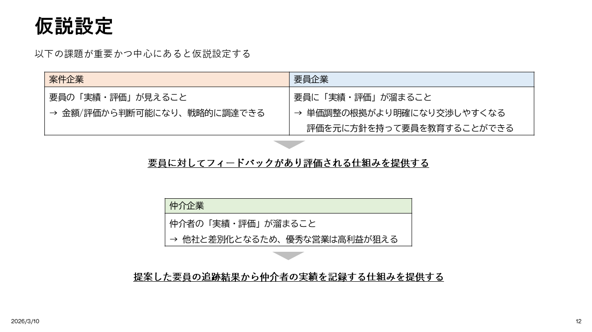

以下の課題が重要かつ中心にあると仮説設定する 2026/3/9 12 仮説設定 案件企業 要員企業 要員の「実績・評価」が見えること → 金額 / 評価から判断可能になり、戦略的に調達できる 要員に「実績・評価」が溜まること → 単価調整の根拠がより明確になり交渉しやすくなる 　 評価を元に方針を持って要員を教育することができる 仲介企業 仲介者の「実績・評価」が溜まること → 他社と差別化となるため、優秀な営業は高利益が狙える 要員に対してフィードバックがあり評価される仕組みを提供する 提案した要員の追跡結果から仲介者の実績を記録する仕組みを提供する

## Slide 13

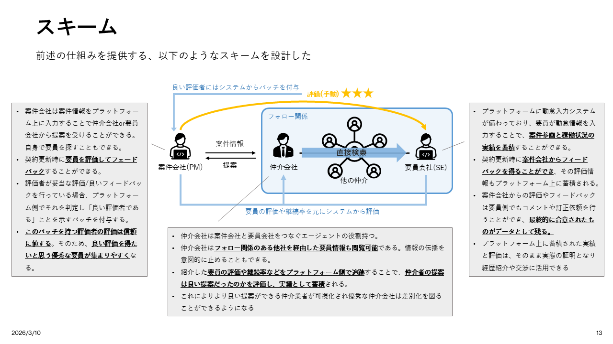

2026/3/9 13 スキーム 案件会社 (PM) 要員会社 (SE) 仲介 会社 案件情報 提案 フォロー関係 前述の仕組みを提供する、以下のようなスキームを設計した 直接検索 他の仲介 評価 ( 手動 ) 良い評価者にはシステムからバッチを付与 要員の評価や継続率を元にシステムから評価 案件会社は案件情報を プラットフォーム上 に入力することで仲介会社 or 要員会社から提案を受けることができる。自身で要員を探すこともできる。 契約更新時に 要員を評価してフェードバック することができる。 評価者が妥当な評価 / 良いフィードバックを行っている場合、プラットフォーム側でそれを判定し「良い評価者である」ことを示すバッチを付与する。 このバッチを持つ評価者の評価 は 信頼に値する 。そのため、 良い評価を得たいと思う優秀な要員が集まりやすく なる。 プラットフォームに勤怠入力システムが備わっており、要員が勤怠情報を入力することで、 案件参画と稼働状況の実績を蓄積 することができる。 契約更新時に 案件会社からフィードバックを得ることができ 、その評価情報もプラットフォーム上に蓄積される。 案件会社からの評価やフィードバックは要員側でもコメントや訂正依頼を行うことができ、 最終的に合意されたものがデータとして残る。 プラットフォーム上に蓄積された実績と評価は、そのまま実態の証明となり経歴紹介や交渉に活用できる 仲介会社は案件会社と要員会社をつなぐエージェントの役割持つ。 仲介会社は フォロー関係のある他社を経由した要員情報も閲覧可能 である。情報の伝播を意図的に止めることもできる。 紹介した 要員の評価や継続率などをプラットフォーム側で追跡 することで、 仲介者の提案は良い提案だったのかを評価し、実績として蓄積 される。 これによりより良い提案ができる仲介業者が可視化され優秀な仲介会社は差別化を図ることができるようになる

## Slide 14

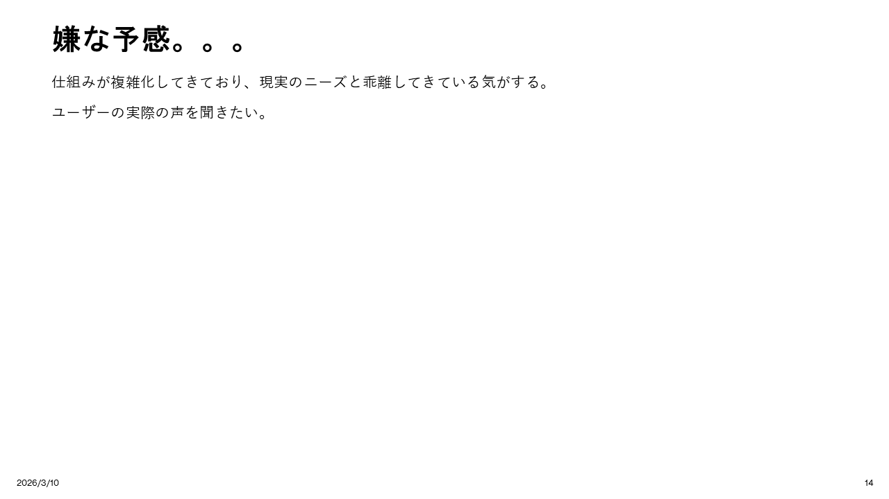

2026/3/9 14 嫌な予感。。。 仕組みが複雑化してきており、現実のニーズと乖離してきている気がする。 ユーザーの実際の声を聞きたい。

## Slide 15

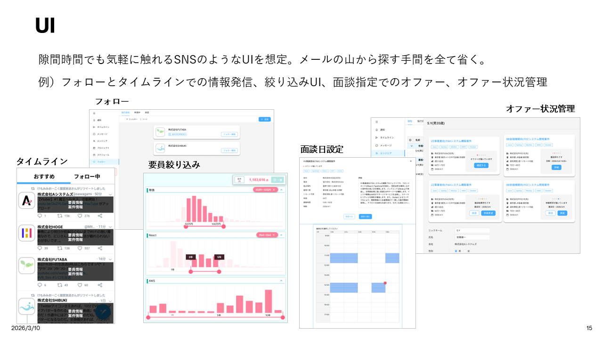

2026/3/9 15 UI 隙間時間でも気軽に触れる SNS のような UI を想定。メールの山から探す手間を全て省く。 例）フォローとタイムラインでの情報発信、絞り込み UI 、面談指定でのオファー、オファー状況管理 タイムライン フォロー 要員絞り込み 面談日設定 オファー状況管理

## Slide 16

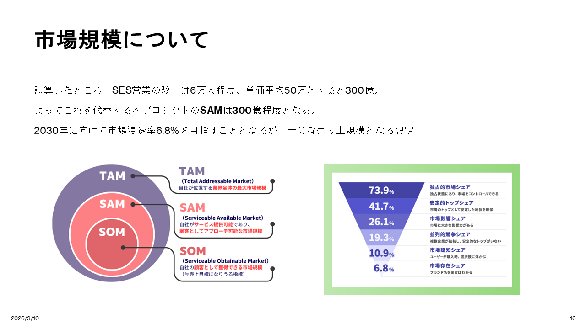

市場規模について 試算したところ「 SES 営業の数」は 6 万人程度。単価平均 50 万とすると 300 億。 よってこれを代替する本プロダクトの SAM は 300 億程度 となる。 2030 年に向けて市場浸透率 6.8% を目指すこととなるが、十分な売り上規模となる想定  2026/3/9 16

## Slide 17

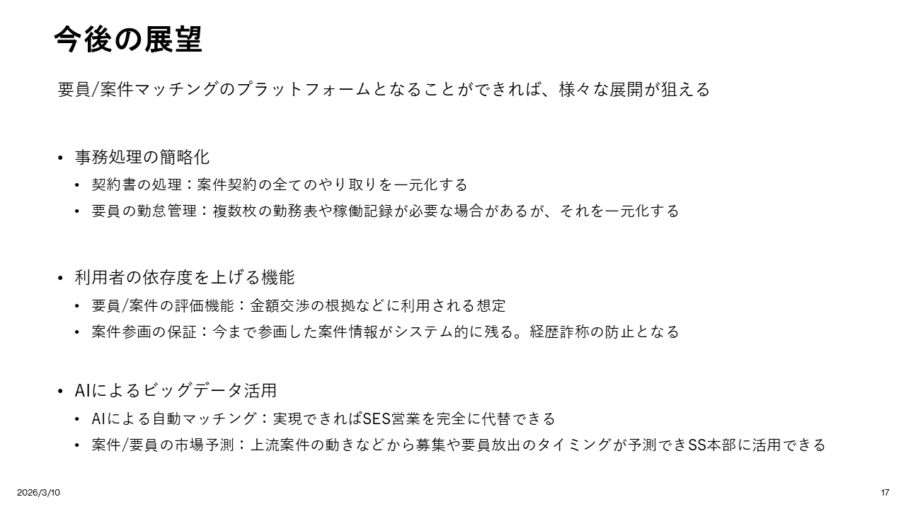

2026/3/9 17 今後の展望 要員 / 案件マッチングのプラットフォームとなることができれば、様々な展開が狙える 事務処理の簡略化 契約書の処理：案件契約の全てのやり取りを一元化する 要員の勤怠管理：複数枚の勤務表や稼働記録が必要な場合があるが、それを一元化する 利用者の依存度を上げる機能 要員 / 案件の評価機能：金額交渉の根拠などに利用される想定 案件参画の保証：今まで参画した案件情報がシステム的に残る。経歴詐称の防止となる AI によるビッグデータ活用 AI による自動マッチング：実現できれば SES 営業を完全に代替できる 案件 / 要員の市場予測：上流案件の動きなどから募集や要員放出のタイミングが予測でき SS 本部に活用できる

## Slide 18

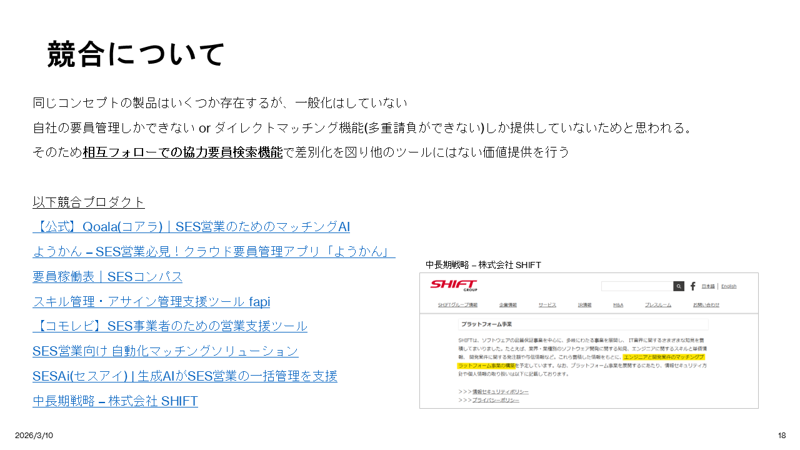

競合について 同じコンセプトの製品はいくつか存在するが、一般化はしていない 自社の要員管理しかできない  or  ダイレクトマッチング機能 ( 多重請負ができない ) しか提供していないためと思われる。 そのため 相互フォローでの協力要員検索機能 で差別化を図り他のツールにはない価値提供を行う 以下競合プロダクト 【 公式 】Q oala ( コアラ ) ｜ SES 営業のためのマッチング AI ようかん  – SES 営業必見！クラウド要員管理アプリ「ようかん 」 要員稼働表 ｜SES コンパス スキル管理・アサイン管理支援ツール  fapi 【 コモレビ 】SES 事業者のための営業支援ツール SES 営業向け 自動化マッチングソリューション SESA i ( セスアイ ) |  生成 AI が SES 営業の一括管理を支援 中長期戦略  –  株式会社  SHIFT 2026/3/9 18 中長期戦略  –  株式会社  SHIFT

## Slide 19

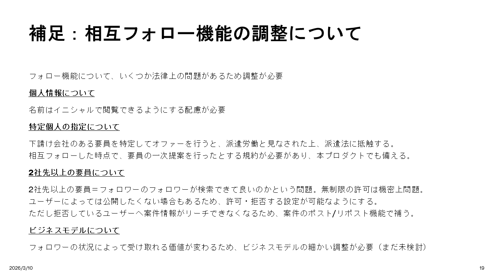

補足：相互フォロー機能の調整について フォロー機能について、いくつか法律上の問題があるため調整が必要 個人情報について 名前はイニシャルで閲覧できるようにする配慮が必要 特定個人の指定について 下請け会社のある要員を特定してオファーを行うと、派遣労働と見なされた上、派遣法に抵触する。 相互フォローした時点で、要員の一次提案を行ったとする規約が必要があり、本プロダクトでも備える。 2社先以上の要員について 2社先以上の要員＝ フォロワーのフォロワーが検索できて良いのかという問題。無制限の許可は機密上問題。 ユーザーによっては公開したくない場合もあるため、許可・拒否する設定が可能なようにする。 ただし拒否しているユーザーへ案件情報がリーチできなくなるため、案件のポスト/リポスト機能で補う。 ビジネスモデルについて フォロワーの状況によって受け取れる価値が変わるため、ビジネスモデルの細かい調整が必要（まだ未検討） 2026/3/9 19

