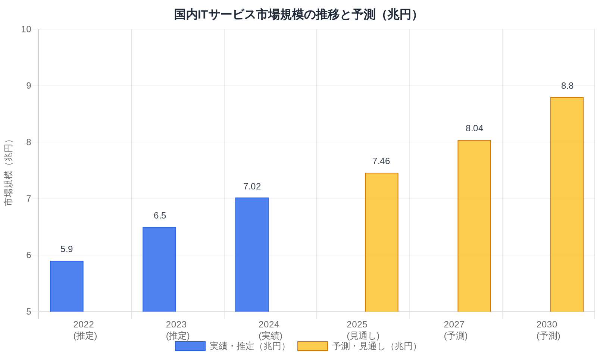
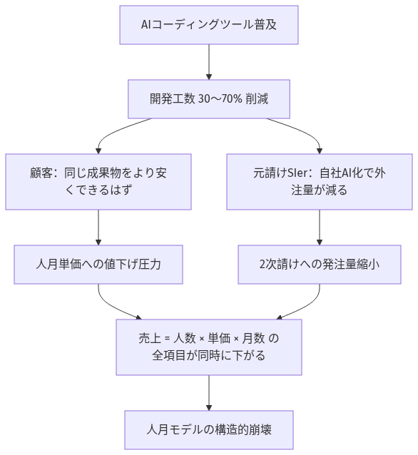
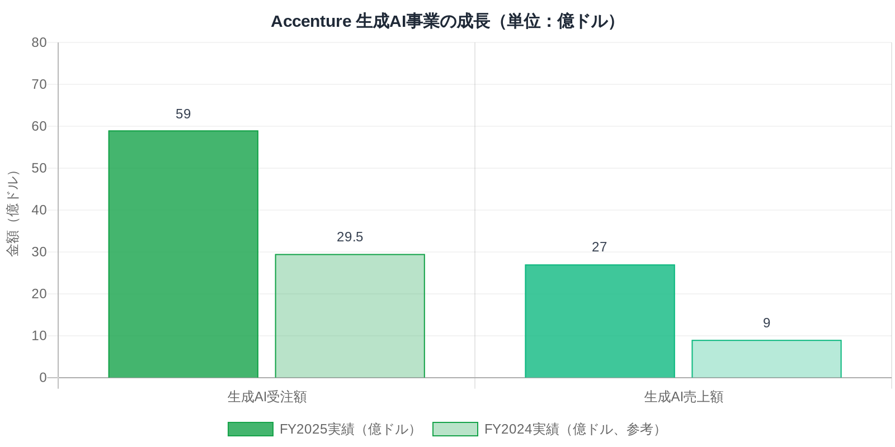
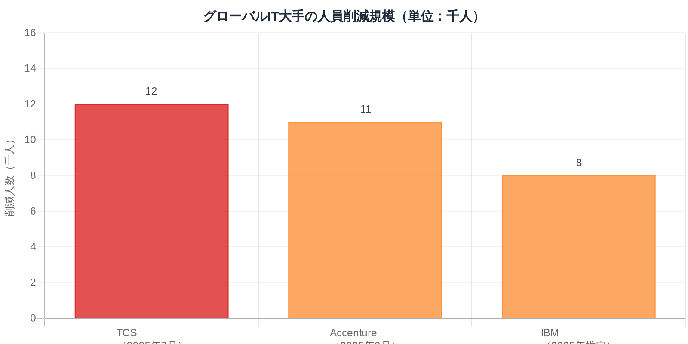
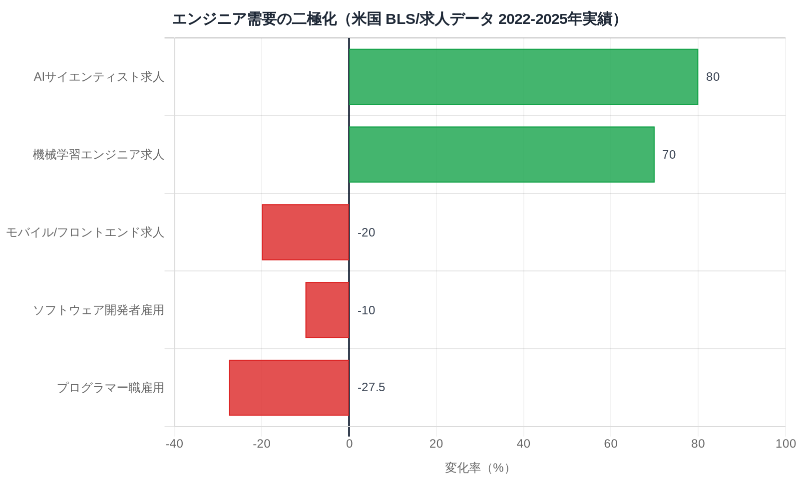
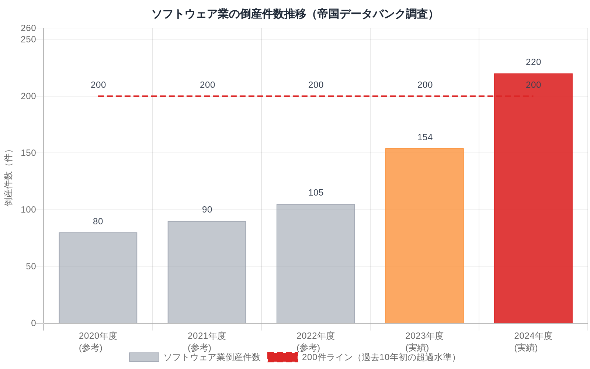
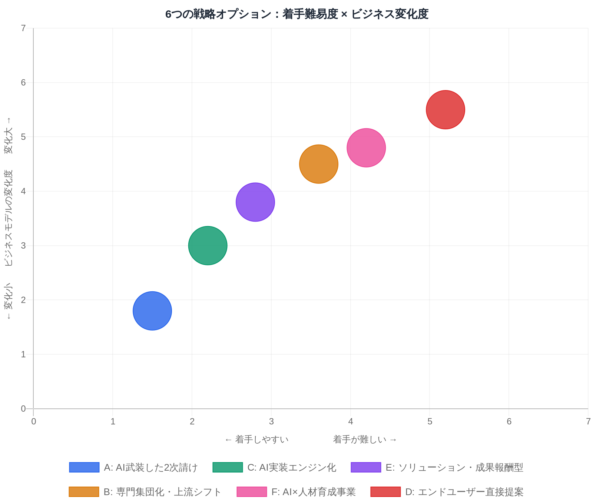

# SI業界の構造転換と2030年戦略

## ～人月モデルの終焉と、100名規模2次請けSIerの生き残り方向性～

**作成日：** 2026年3月7日
**対象：** 社内向け（2030年中期計画の前提情報・戦略立案用途）
**前提：** 従業員100名・売上32億円・大手SIer向け2次請け中心・インフラ/アプリ/Web/AI部隊を保有

---

## エグゼクティブサマリー

国内SI市場は現在も成長中だ。DX需要は旺盛で、仕事は来ている。しかしその好況の裏側では、当社の収益の根幹である「人月モデル」が構造的に崩れ始めている。

AIによる生産性向上は工数を削減する。工数が減れば、人月ベースの売上は同時に減る。これは将来の予測ではなく、グローバルでは既に起きていることだ。Salesforceは2025年にソフトウェアエンジニアの新規採用をゼロにした。インドのSIer大手TCSは12,000人を削減した。インドIT大手5社の新卒採用は一時75%減少した。日本はこの波の数年後を走っている。

「でもIT人材不足は続くのでは？」という疑問は正しい問いだ。ただし不足するのは「AIを使いこなせる人材」であり、従来型のコーディング中心の業務は縮小する。これは矛盾ではなく、同じIT業界の中での仕事の質的な二極化だ。

当社が今考えるべきは「この変化にどのように乗るか」という問いだ。本レポートでは、業界構造の変化メカニズムを整理した上で、当社が取り得る戦略の方向性を複数提示する。

---

## 目次

1. [今の好況が隠している構造問題](#1-今の好況が隠している構造問題)
2. [なぜ人月モデルが崩れるのか](#2-なぜ人月モデルが崩れるのか)
3. [グローバルでは既に起きている](#3-グローバルでは既に起きている)
4. [「AI代替」と「人材不足」は矛盾しない](#4-ai代替と人材不足は矛盾しない)
5. [なぜ日本のSIerが特にリスクを負うのか](#5-なぜ日本のsierが特にリスクを負うのか)
6. [日本国内での変化の兆候](#6-日本国内での変化の兆候)
7. [当社のポジション整理](#7-当社のポジション整理)
8. [2030年に向けた戦略の方向性](#8-2030年に向けた戦略の方向性)

---

## 1. 今の好況が隠している構造問題

[IDC Japanの調査](https://www.imagazine.co.jp/idc-it-service-market2024/)によれば、2024年の国内ITサービス市場は7兆205億円（前年比+7.4%）と好調だ。官公庁の大型システム刷新、基幹システムのモダナイゼーション、DX推進への投資拡大が重なり、受注環境は悪くない。

しかし「市場が成長している」という事実と「その成長の恩恵が当社に届く」という話は、全く別の話だ。

[東洋経済の分析](https://toyokeizai.net/articles/-/918769)が示すように、大手SIerはこの2〜3年で大規模な体力強化に動いている。NTTデータはNTTグループによる完全子会社化（約2.4兆円のTOB）でAI投資を加速し、SCSKは住友商事に取り込まれネットワンシステムズの買収も完了した。富士通のAI・DXサービス「Fujitsu Uvance」は2024年度に前年比31%増の4,828億円を記録している。

大手が体力をつけてAI時代に備えるほど、彼らは「下請けに出すより自社でやる」「AIで少人数でやれる」方向に動く。市場が成長していても、そのパイを誰が取るかが変わりつつある。今の好況は、転換期の前の「最後の安定期」かもしれない。

---

## 2. なぜ人月モデルが崩れるのか

当社の収益構造を一言で言えば「エンジニアの頭数 × 単価 × 稼働月数」だ。この等式を理解すると、AIがなぜ根本的な脅威になるかが見えてくる。

AIコーディングツールが開発工数を30%削減したとする。顧客視点では「同じ成果物を以前より少ない工数で作れるはずだ」という認識になる。人月ベースの契約なら、顧客は「工数が減ったのだから料金も下げてほしい」と要求する。これは論理的に正当な主張だ。

[日経xTECHの報道](https://xtech.nikkei.com/atcl/nxt/column/18/00849/00178/)によると、大手SIerのTISは「2029年度までにシステム開発生産性50%向上」を正式目標として掲げた。元請けSIerが生産性を50%向上させるということは、同じプロジェクトに必要な総工数が減るということだ。2次請けへの発注量も連動して縮小する。

さらに深刻なのは、この圧力が元請けから発注量として直接やってくる点だ。元請けSIerが自社の生産性を上げれば、2次請けへの「頭数を集める」依頼が減る。[日経ビジネスの指摘](https://business.nikkei.com/atcl/gen/19/00322/102900152/)を借りれば「5年もあれば、ウォーターフォール型のシステム開発は生成AIで自動化できる」という見方が業界内に広がっており、「下請け技術者の大半が無用の存在に化す」可能性が議論されている。

**人月モデルの構造的弱点を整理すると：**

- 工数が減る → 発注量が減る → 売上が連動して下がる
- 元請けがAI活用を進めるほど、2次請けへの依存度が下がる
- 「人を集めて単価差で稼ぐ」モデルは、AIが単価差を埋めれば成立しなくなる

---

## 3. グローバルでは既に起きている

「将来こうなるかもしれない」という話ではない。米国とインドでは、今まさにこの変化が現実として進行している。

### 米国：エンジニア採用の急速な収縮

[米国労働統計局（BLS）のデータ](https://www.bls.gov/opub/ted/2025/ai-impacts-in-bls-employment-projections.htm)によると、ソフトウェア開発者の雇用は2023年から2024年にかけて約10%減少した。より機械的なコーディングを担う「プログラマー」職種に至っては、同期間で27.5%の減少だ。求人数もピーク比で49%減少している。

しかしこれは単純な業界縮小ではない。同じ期間に、AIサイエンティストの求人は80%増加し、機械学習エンジニアは70%増加している。「エンジニアが必要なくなった」のではなく「求められるエンジニアの種類が変わった」のだ。

最も象徴的な出来事が、[Salesforce CEOのマーク・ベニオフ氏の宣言](https://www.salesforceben.com/salesforce-will-hire-no-more-software-engineers-in-2025-says-marc-benioff/)だ。「Agentforceなどのアシスタントが今年のエンジニア生産性を30%以上向上させた。2025年はソフトウェアエンジニアの新規採用を行わない可能性がある」──SalesforceはIT業界を代表する巨大企業であり、この発言はエンジニア採用に対する市場の見方を根底から変えた。

### インド大手SIer：人月モデル崩壊の先行事例

日本のSIer業界に最も近い構造を持つのが、インドの大手ITサービス企業群（TCS、Infosys、Wipro等）だ。大量の人材を抱えて人月ベースで欧米企業に提供するというモデルは、日本の下請けSIerと本質的に同じだ。

このインドSIerモデルが、2025年に大きく揺らいだ。[TCSは2025年7月に12,000人を削減](https://smefutures.com/when-ai-came-for-it-crowd-inside-tcss-12000-layoffs-and-new-face-of-tech-employment/)した（同社史上初の大規模レイオフ）。新卒採用は一時60万人から15万人へ75%減少した。インド大手5社は2025年の9ヶ月間で合計時価総額1,500億ドル超を失っている。

[GetGenerative.aiの分析](https://www.getgenerative.ai/india-it-pyramid-collapse-ai/)はこれを「インドITのピラミッドが崩壊している」と表現し、AIが安価な人月モデルの前提を根底から覆していると指摘する。

### Accenture：「転換できない人は退出」

一方、AI転換に成功している側の代表例がAccentureだ。[FY2025の全社業績](https://www.businesswire.com/news/home/20250925362225/en/Accenture-Reports-Fourth-Quarter-and-Full-Year-Fiscal-2025-Results)では生成AI受注59億ドル（前年比2倍）、生成AI売上27億ドル（前年比3倍）を達成した。しかし同時に[2025年9月に11,000人以上を削減](https://www.cxtoday.com/contact-center/accenture-lays-off-11000-staff-as-part-of-ai-reskilling-strategy/)している。削減の基準は明確で「AIリスキリングができないと判断された人材」だ。成長しながら、同時に旧来型の人材を入れ替えている。

**グローバルで起きていることの共通構造：**

- AI転換に成功した企業 → 売上・収益が急拡大
- AI転換できない企業・人材 → 発注量の減少、雇用の収縮
- この二極化は現在進行形であり、日本への波及は時間の問題だ

---

## 4. 「AI代替」と「人材不足」は矛盾しない

ここまで読んで「でも国内のIT人材不足は深刻なはずだ」と感じた人もいるだろう。確かに[経済産業省の調査](https://www.meti.go.jp/policy/it_policy/jinzai/gaiyou.pdf)は2030年に最大79万人のIT人材不足を予測している。これはAIによる雇用縮小と矛盾しないか？

矛盾しない。ただし、この「不足」と「縮小」が指している人材の種類が異なる。

**縮小するのは：** コーディング・テスト・定型的な設計など、AIが代替しやすい「実装工程」を主な仕事とする人材の需要
**不足するのは：** AI活用スキル、上流の要件定義・アーキテクチャ設計、業務知識を持った技術者、AIシステムを運用・管理できる人材

米国の求人データは、この二極化をすでに数字で示している。プログラマーが減り、AIエンジニアが増えている。[Accenture自身もAI・データ専門人材を2023年の40,000人から2025年に77,000人へ倍増](https://www.cnbc.com/2025/09/26/accenture-plans-on-exiting-staff-who-cant-be-reskilled-on-ai.html)させた一方で、旧来型の人材は削減している。

国内でも同様の傾向が現れている。[FLEXY等の調査](https://flxy.jp/media/article/28622)では、AIエンジニアの月単価は50〜150万円超と、一般的なエンジニアとの格差が広がっている。[PwCの「AI Jobs Barometer」](https://flxy.jp/media/article/28622)は世界15カ国・5億件超の求人分析から、AIスキルを求める職種は平均25%の賃金プレミアムを得ていると示した。

**整理すると：**
「2030年に79万人のIT人材が不足する」と「AIがエンジニアの仕事を代替する」は、どちらも正しい。ただし前者は「AIを使いこなせる先端人材」の不足であり、後者は「従来型コーディング業務」の縮小だ。同じ「エンジニア」という言葉で指しているものが変わっている。

当社にとっての問いは「100名のエンジニアのうち、どちらの方向に仕事が変わるか」だ。

> 出典：AI科学者・機械学習エンジニア求人数は LinkedIn/Indeed 求人データ（2022年ピーク比）、ソフトウェア開発者・プログラマー雇用数は米国労働統計局（BLS）雇用統計（2023-2024年）

---

## 5. なぜ日本のSIerが特にリスクを負うのか

インドと日本のSIerが似た構造を持つと述べたが、日本には固有の増幅要因がある。

[総務省「情報通信白書」（2018年版）のデータ](https://paiza.hatenablog.com/entry/2019/12/04/%E5%9B%BD%E9%9A%9B%E6%AF%94%E8%BC%83%E3%81%A7%E8%A6%8B%E3%81%A6%E3%81%8D%E3%81%9F%E3%80%81%E6%97%A5%E6%9C%AC%E3%81%AEIT%E6%A5%AD%E7%95%8C%E3%81%8C%E6%8A%B1%E3%81%88%E3%81%A6%E3%81%84%E3%82%8B)では、日本のITエンジニアの約72%がSIer（ベンダー企業）に所属している。米国ではこの数字が逆転しており、約65%がユーザー企業の内部エンジニアだ。

この構造差が何を意味するか。

米国でAIが開発工数を削減すると、削減の影響はユーザー企業の内部エンジニア（内製部門）に分散される。しかし日本では、同じ削減の影響がSIerに集中して降り注ぐ。日本のシステム開発の多くは、ユーザー企業がSIerに外注する構造だ。AIで工数が削減されれば、その煽りはSIerの受注量の減少として直撃する。

加えて、[ガートナージャパンの調査（2023年）](https://www.gartner.co.jp/ja/newsroom/press-releases/pr-20230118)では日本のユーザー企業の54.4%が「内製化の方向」を志向していると回答している。AIコーディングツールの普及により「内製は難しい」という従来の常識が崩れつつあり、この内製化圧力はますます強まる方向だ。

日本のSIer業界は「AIによる工数削減の打撃を最も集中的に受ける構造」になっている。

---

## 6. 日本国内での変化の兆候

グローバルの話だけではない。国内でも変化の兆候はすでに現れている。

**倒産件数の急増：** [帝国データバンクの調査](https://www.tdb.co.jp/report/industry/20250423-software-br24fy/)では2024年度のソフトウェア業倒産が220件（前年度154件から1.4倍増、過去10年で初の200件超）に達した。倒産要因の一つとして「ユーザー企業の内製化進展」が明示的に挙げられている。予測ではなく、既に起きている変化だ。

**大手SIerのAI転換が加速：** [NTTデータは2025年10月時点でAI実践研修修了者が7万人を超え](https://www.nikkei.com/article/DGKKZO93538910R00C26A1MM8000/)（当初目標3万人を大幅前倒しで達成）、2026年度中に「AIネイティブ開発」（AIが開発工程全体を主導）の本格導入を決定した。元請けがAI化するほど、2次請けへの発注量の性質が変わる。

**工数削減の実証：** [ROUTE06の調査（2025年11月、国内SIer・ITベンダー325社の部長職対象）](https://atmarkit.itmedia.co.jp/ait/articles/2512/12/news057.html)では、要件定義専用AIツールを導入した企業の74%が工数を「半分以上削減」した。NTTデータの社内実証では製造工程で70%の作業時間削減を達成している。これらは実験ではなく、現場で実際に起きた変化だ。

**価格モデルの変化（グローバル先行）：** [a16z（Andreessen Horowitz）の2024年12月調査](https://a16z.com/newsletter/december-2024-enterprise-newsletter-ai-is-driving-a-shift-towards-outcome-based-pricing/)では、SaaS業界で「座席数課金」の採用率が1年間で21%から15%へ急落し、成果ベースのハイブリッド型が27%から41%へ拡大した。ITサービス業界全体として、時間工数ベースの契約から成果ベース契約への移行圧力が高まっている。

---

## 7. 当社のポジション整理

ここまでの状況を踏まえ、当社（100名・32億円）のビジネス実態と、強み・課題を整理する。

### ビジネス構造の実態

当社のSI事業は複数の受注チャネルを持つ。官公庁向けの直接案件を担うチーム、大手SIerからの2次請け案件を担うチーム、請負契約ベースのチームが並立している。

提供価値の中核は「リーダー人材 × パートナー体制」だ。当社のリーダーエンジニアを1名投入し、その下にパートナー会社から複数名を参画させてチームを組成する。パートナーは基本的に別会社から1次転籍（紹介）の形で提供を受け、マージンを上乗せして客先に常駐させる構造だ。

このモデルの競争力の源泉は「リーダー人材の質」にある。当社は社内教育に注力しており、帰属意識が高く、育成に投資する組織文化が確立している。

SI事業の外に、コミュニケーション教育事業「コミュニトレ」を持つ。対面でのコミュニケーションスキル（上司・部下関係、顧客対応、ミーティングファシリテーション等）を扱うトレーニングサービスだ。コロナ禍の影響で対面需要が落ち込み現在は縮小傾向にあるが、「人のコミュニケーション力を組織的に育てるノウハウ」という蓄積は、AI時代に改めて価値を持ちうる資産だ。

### 強み

- インフラ・アプリ・Web・AIと幅広い技術領域（フルスタック対応力）
- 官公庁・大手SIer・請負と複数チャネルを持ち、リスクが分散されている
- リーダー人材育成への投資と高い帰属意識（転換期に組織が瓦解しにくい）
- AI部隊が既に存在する（業界平均より早い着手）
- コミュニトレのノウハウ（人材育成・コミュニケーション指導力）

### 課題

- 収益の大部分が人員派遣型（リーダー＋パートナー体制）に依存しており、AIで工数が削減されると売上に直結して影響する
- パートナーへのマージン依存構造は、元請けからの単価圧縮をそのまま下に転嫁しにくく、利益率の圧迫要因になりうる
- 「幅広さ」は現状の強みだが、AI時代には特定領域での専門性の深さとの両立が必要
- コミュニトレ事業が縮小傾向にあり、ノウハウが埋もれるリスク
- AI活用の全社標準化がまだ途上

### 今後5年で問われること

元請けSIerが「AIで生産性を上げ、発注量を絞る」動きをした時に、当社は「それでも使いたい」と思われる理由を持っているか。また、人員を出すことではなく「課題を解決すること」でお金をもらえるビジネスに、どこまで移行できるか。

---

## 8. 2030年に向けた戦略の方向性

以下に6つの方向性を提示する。これらは排他的な選択肢ではなく、組み合わせや段階的な移行も可能だ。数値目標は現時点では設定せず、方向性とその根拠、向いている状況を整理する。

---

### 方向性A：「AI武装した2次請け」として指名力を高める

**概要：** 現在の大手SIer向け2次請けというポジションを維持しながら、AIツールの全社標準化によって「生産性・品質・スピード」で圧倒的な差を作る。リーダー人材がAIを使いこなしてチームを率いる体制を作り、元請けから「あの会社のリーダーを使えば、同じ人数でより多くのアウトプットが出る」と認識させる。

**なぜ有効か：** 大手SIerは「AIを使いこなせる下請け」と「使えない下請け」を選別し始めている。現時点では前者が少ないため、早期に動けばポジションが取れる。[GitHub CopilotのAccentureとの共同研究](https://github.blog/news-insights/research/research-quantifying-github-copilots-impact-in-the-enterprise-with-accenture/)では、導入企業のコーディングタスクが平均55%速く完了している。[テックファームの事例](https://techplay.jp/column/2068)では全社導入で工数最大80%削減という効果も報告されている。

**具体的なアクション：**

- GitHubCopilot・Cursor等のAIコーディングツールを全エンジニアに標準装備（1年以内）
- AI部隊を「AI推進室」として全部隊横断の支援役に再定義
- AI活用による生産性改善データを定期計測し、元請けへの実績として提示

**向いている状況：** まず足元を固めたい段階、転換への準備期間として。
**限界：** 2次請け依存が続く限り、元請けがAI化で発注を絞った時の影響を直接受け続ける。

---

### 方向性B：特定ドメインの「専門集団」として上流にシフトする

**概要：** インフラ・アプリ・Web・AIという幅広さを維持しながら、特定の業種×技術領域（例：金融系インフラのクラウド移行、製造系の業務アプリ×AI連携）に「深さ」を加える。そのドメインでは要件定義・アーキテクチャ設計まで担い、元請けから「この分野ならあの会社」と指名される専門集団を目指す。

**なぜ有効か：** AIが汎用的なコーディングを代替するほど、「業務知識×技術力」の組み合わせは差別化になる。[MITスローンの研究](https://mitsloan.mit.edu/ideas-made-to-matter/how-digital-business-models-are-evolving-age-agentic-ai)では、特定業種への深い専門性を持つ企業が業界平均を上回る収益成長を実現している。上流工程は「AIで代替しにくい」領域でもあり、単価プレミアムも期待できる。

**具体的なアクション：**

- 既存案件の収益性・継続性・拡張可能性を分析し、重点領域を1〜2つに絞り込む
- 絞り込んだ領域での上流提案ができる人材の育成・採用に集中投資
- 元請けSIerとの関係を「何でも請ける下請け」から「この領域のパートナー」に再定義

**向いている状況：** 特定の取引先・業種で深い実績がある場合、中長期の投資が可能な状況。
**課題：** 専門領域の絞り込みには現場の棚卸しと経営判断が必要。実績が出るまでに2〜3年かかる。

---

### 方向性C：大手SIerの「AI実装エンジン」になる

**概要：** 大手SIerが販売するAIサービスの「実装・運用を担うパートナー」ポジションを意図的に取りに行く。NTTデータのAIエージェントサービス、富士通のUvance、日立のAIエージェント提供サービスなど、大手は次々とAIサービスを市場投入している。しかし「売る側」と「実際に作る・動かす側」は別だ。当社のAI部隊を核に、これらのAIサービスの実装・運用を担う体制を作る。

**なぜ有効か：** 大手SIerのAIサービスが増えるほど、その実装需要は増える。現在の2次請け構造を活かしながら、受注の性質を「コーディング人月」から「AI実装の専門技術」に変えることができる。大手から「AI案件はあの会社に任せられる」と認識されれば、単価と継続性が向上する。

**具体的なアクション：**

- 大手SIer各社が展開するAIプラットフォーム（Azure AI、AWS Bedrock、OpenAI等）の実装資格・実績を積極的に取得
- AI部隊が中心となり、インフラ・アプリ・Web部隊との連携でAIシステムのフルスタック実装体制を構築
- 特定の元請けSIerに対して「AI案件の協力会社」として積極的に売り込む

**向いている状況：** 既存のAI部隊の強みをすぐに活かしたい、短中期でポジション変化を作りたい場合。
**課題：** 大手SIerのAI戦略に依存するため、元請け依存の構造からは完全には抜け出せない。

---

### 方向性D：エンドユーザー直接提案への段階的移行

**概要：** 特定業種のユーザー企業に対して、SIerを経由せず直接AI導入支援・DX推進を提案する体制を作る。当面は大手SIer経由の仕事を維持しながら、特定顧客・特定案件では直接関係を開拓する。

**なぜ有効か：** 大手SIerを経由するビジネスである限り、単価にはマージンの圧縮が続く。エンドユーザーと直接関係を持てば、マージン圧縮がなくなり、顧客ニーズを直接理解した提案ができ、ビジネスの主導権を取れる。[ガートナージャパンの調査](https://www.gartner.co.jp/ja/newsroom/press-releases/pr-20230118)では54.4%のユーザー企業が内製化方向を志向しているが、完全内製は難しい企業も多く「信頼できる外部パートナー」へのニーズは存在する。

**具体的なアクション：**

- 方向性Bで絞り込む特定ドメインと連動し、そのドメインのユーザー企業への直接接触機会を模索
- 現在の大手SIerとの関係を活かしながら、一部案件で「当社からエンドユーザーへの提案」を試みるパイロットを設計
- 営業・提案機能の内製化（現在は元請け経由で完結しているため、ここは新たな能力が必要）

**向いている状況：** 中長期（2028年以降）で取り組む方向性として。独立性の高いビジネスを目指す経営判断がある場合。
**課題：** 営業・提案機能の立ち上げが必要で、大手SIerとの関係に注意が必要。最も難易度が高く、時間がかかる。

---

### 方向性E：ソリューション型・成果報酬型への契約転換

**概要：** 「人を出した時間に対してお金をもらう」モデルから、「課題を解決したことに対してお金をもらう」モデルへの転換を一部案件から試みる。AIを使った自動化・効率化の効果を可視化し、その効果に対して報酬を設定する成果報酬型や、月額定額のサブスクリプション型も含む。

**なぜ有効か：** 人月モデルの崩壊は、逆に言えば「工数削減の効果をそのまま自社利益にできる」モデルに転換するチャンスでもある。AIで工数を半分にしても、成果報酬型なら売上は維持できる。グローバルでは既にこの転換が始まっている。[a16zの調査](https://a16z.com/newsletter/december-2024-enterprise-newsletter-ai-is-driving-a-shift-towards-outcome-based-pricing/)ではITサービスの成果報酬型契約が1年で27%→41%に拡大した。国内でも[野村総合研究所が2024年に「AI導入効果連動型」契約を大手製造業向けに展開](https://xtech.nikkei.com/atcl/nxt/column/18/02812/092600003/)するなど、先行事例が生まれている。

**当社固有の優位点：** リーダー人材が「AIを使って何をどれだけ効率化したか」を可視化できれば、その効果を成果として売れる。現在の「リーダー＋パートナー体制」は、工数コストのコントロールが比較的容易という特徴があり、成果報酬型に移行した際の利益率向上効果が大きい。

**向いている状況：** 継続的な関係がある顧客で、効果測定が可能な案件から試験導入する。
**課題：** 効果の定義と測定方法の合意が必要。顧客の理解と契約交渉力が求められる。

---

### 方向性F：コミュニトレ資産を活かした「AI × 人材育成」事業

**概要：** 縮小傾向にあるコミュニトレ事業を単体で再生するのではなく、「コミュニケーション育成ノウハウ × AI技術」を組み合わせた新しいサービスとして再定義する。具体的には、AIを活用したコミュニケーション訓練ツール（AIロールプレイ）の開発、またはSI人材のAIリスキリングと組み合わせた育成プログラムの提供などが考えられる。

**なぜ有効か：** AI時代に最も求められる人材は「技術力とコミュニケーション力を兼ね備えた上流人材」だ。技術的なAI活用訓練と、顧客との対話・要件定義・ファシリテーション力を組み合わせた育成プログラムは、他のSIerにはない差別化になりうる。自社エンジニアの育成に使うだけでなく、外部向けに提供する可能性もある。

**外部事例：** [Udemyが2024年にAIロールプレイ機能を法人向けに提供開始](https://www.udemy.com/ub/)し、コミュニケーション訓練のデジタル化が進んでいる。国内でも[リクルートの「スタディサプリENGLISH」がAIスピーキング練習](https://eigosapuri.jp/)を展開するなど、AI×コミュニケーション育成のサービス化が加速している。

**向いている状況：** コミュニトレのノウハウを活かしたい、自社エンジニアの上流人材化と連動させたい場合。
**課題：** 新しい開発投資が必要。プロダクト型への転換であるため、SI事業とは異なるビジネス設計が必要。

---

### 6つの方向性の位置づけ

| 方向性 | 難易度 | 時間軸 | 現状からの変化の大きさ |
| -------- | -------- | -------- | ---------------------- |
| A：AI武装した2次請け | 低 | 1〜2年 | 小（やり方を変える） |
| C：AI実装エンジン化 | 中 | 1〜3年 | 中（受注の種類を変える） |
| E：ソリューション・成果報酬型 | 中 | 2〜4年 | 中（契約モデルを変える） |
| B：専門集団化・上流シフト | 中 | 2〜4年 | 中（何に集中するかを変える） |
| F：AI×人材育成事業 | 中〜高 | 2〜5年 | 中〜大（新事業を作る） |
| D：エンドユーザー直接提案 | 高 | 3〜5年 | 大（ビジネスモデルを変える） |

**現実的な取り組み順序として：**
まずAとCで足元を固め（1〜2年）、並行してEの成果報酬型への試験移行を一部案件で開始する。その中で生まれた専門性や実績でBへ深化させ（2〜4年）、コミュニトレ資産を活かしたFをAI人材育成の文脈で再設計する。特定領域でDの可能性を探るのは3年以降だ。A〜Eは現状の強みを活かしながら段階的に積み上げられる点が共通している。

---

*本レポートは2026年3月7日時点の公開情報を基に作成。引用した調査・統計データはそれぞれ出典を明示している。*

作成支援：Claude Sonnet 4.6（Anthropic）
